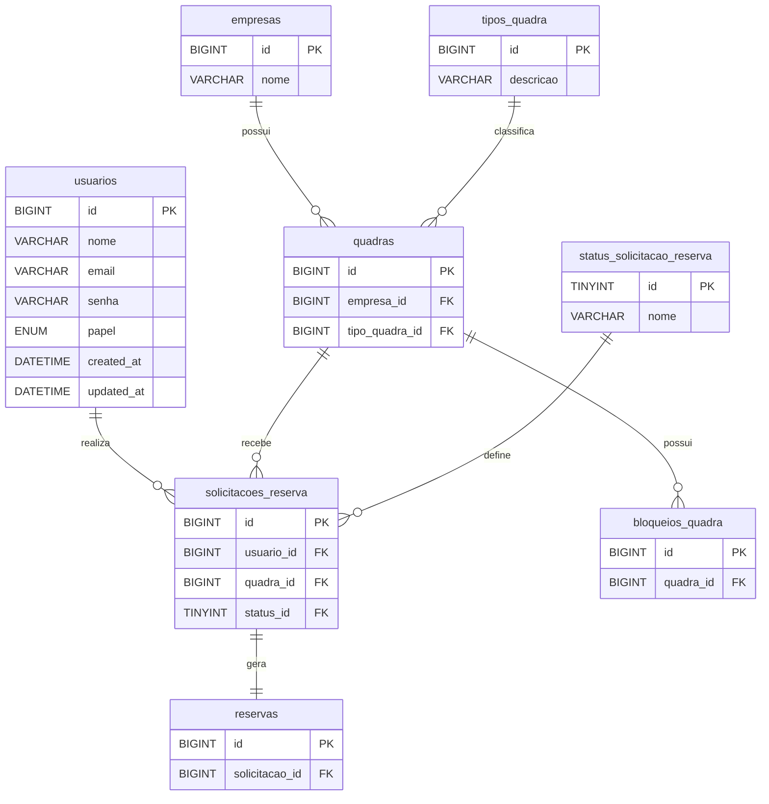

# bah_quadras_db

## Ordem de Execucao
1. 04_tables
2. 05_triggers
3. 99_inserts

## Modelo Entidade Relacionamento

```mermaid
erDiagram
    usuarios ||--o{ solicitacoes_reserva : realiza
    empresas ||--o{ quadras : possui
    tipos_quadra ||--o{ quadras : classifica
    quadras ||--o{ solicitacoes_reserva : recebe
    status_solicitacao_reserva ||--o{ solicitacoes_reserva : define
    solicitacoes_reserva ||--|| reservas : gera
    quadras ||--o{ bloqueios_quadra : possui

    usuarios {
        BIGINT id PK
        VARCHAR nome
        VARCHAR email
        VARCHAR senha
        ENUM papel
        DATETIME created_at
        DATETIME updated_at
    }

    empresas {
        BIGINT id PK
        VARCHAR nome
    }

    tipos_quadra {
        BIGINT id PK
        VARCHAR descricao
    }

    quadras {
        BIGINT id PK
        BIGINT empresa_id FK
        BIGINT tipo_quadra_id FK
    }

    status_solicitacao_reserva {
        TINYINT id PK
        VARCHAR nome
    }

    solicitacoes_reserva {
        BIGINT id PK
        BIGINT usuario_id FK
        BIGINT quadra_id FK
        TINYINT status_id FK
    }

    reservas {
        BIGINT id PK
        BIGINT solicitacao_id FK
    }

    bloqueios_quadra {
        BIGINT id PK
        BIGINT quadra_id FK
    }
```
